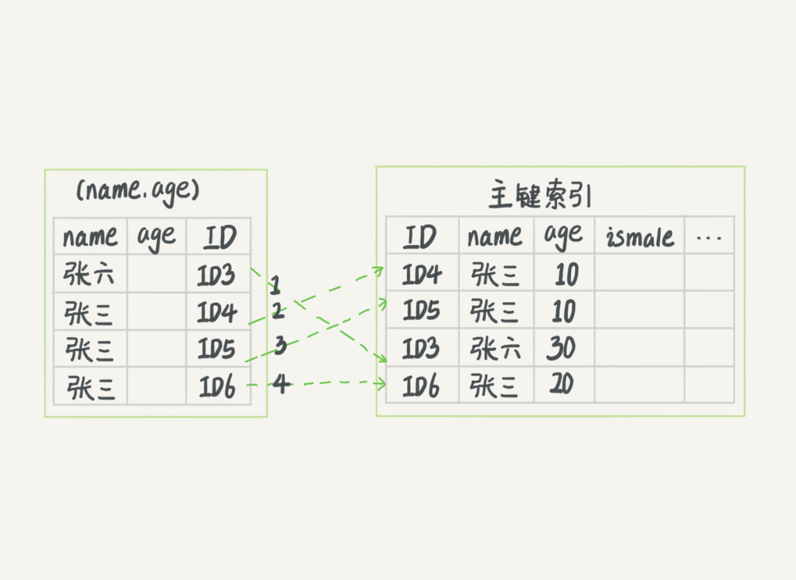

# mysql笔记

## 1、基础架构

### 1.1、问题：

1. MySQL的框架有几个组件, 各是什么作用? 
2. Server层和存储引擎层各是什么作用?
3. you have an error in your SQL syntax 这个保存是在词法分析里还是在语法分析里报错?
4. 对于表的操作权限验证在哪里进行?
5. 执行器的执行查询语句的流程是什么样的?
6. 如果表 T 中没有字段 k，而你执行了这个语句 select * from T where k=1, 那肯定是会报“不存在这个列”的错误： “Unknown column ‘k’ in ‘where clause’”。你觉得这个错误是在我们上面提到的哪个阶段报出来的呢？


### 1.2、内容：


#### 1.2.1、mysql的基本架构图

MySQL 可以分为 Server 层和存储引擎层两部分


#### 1.2.2、连接器

```sql
--远程连接数据库命令
mysql -h$ip -P$port -u$user -p

--查看连接状态（command列显示）
show processlist;
```

客户端如果太长时间没动静，连接器就会自动将它断开。这个时间是由参数 wait_timeout 控制的，默认值是 8 小时。

但是全部使用长连接后，你可能会发现，有些时候 MySQL 占用内存涨得特别快，这是因为 MySQL 在执行过程中临时使用的内存是管理在连接对象里面的。这些资源会在连接断开的时候才释放。所以如果长连接累积下来，可能导致内存占用太大，被系统强行杀掉（OOM），从现象看就是 MySQL 异常重启了。

怎么解决这个问题呢？你可以考虑以下两种方案。

1. 定期断开长连接。使用一段时间，或者程序里面判断执行过一个占用内存的大查询后，断开连接，之后要查询再重连。
2. 如果你用的是 MySQL 5.7 或更新版本，可以在每次执行一个比较大的操作后，通过执行 mysql_reset_connection 来重新初始化连接资源。这个过程不需要重连和重新做权限验证，但是会将连接恢复到刚刚创建完时的状态。

#### 1.2.3、查询缓存（8.0后没有此功能）

命中缓存则查询缓存，但是大多数情况下我会建议你不要使用查询缓存，为什么呢？**因为查询缓存往往弊大于利**


#### 1.2.4、分析器


##### 1.2.4.1、词法分析

如果没有命中缓存则开始真正的执行语句，分析器先会做“词法分析”。你输入的是由多个字符串和空格组成的一条 SQL 语句，MySQL 需要识别出里面的字符串分别是什么，代表什么。MySQL 从你输入的"select"这个关键字识别出来，这是一个查询语句。它也要把字符串“T”识别成“表名 T”，把字符串“ID”识别成“列 ID”。

##### 1.2.4.2、语法分析

根据词法分析的结果，语法分析器会根据语法规则，判断你输入的这个 SQL 语句是否满足 MySQL 语法。

例如：

```sql
elect * from where id =1;

ERROR 1064 (42000): You have an error in your SQL syntax; check the manual that corresponds to your MySQL server version for the right syntax to use near 'elect * from where id =1' at line 1
```


如果你的语句不对，就会收到“You have an error in your SQL syntax”的错误提醒（为**语法分析**问题），比如下面这个语句 select 少打了开头的字母“s”。位置提示是在：一般语法错误会提示第一个出现错误的位置，所以你要关注的是紧接“use near”的内容。

#### 1.2.5、优化器

优化器是在表里面有多个索引的时候，决定使用哪个索引；或者在一个语句有多表关联（join）的时候，决定各个表的连接顺序。

#### 1.2.6、执行器（权限校验）

开始执行的时候，要先判断一下你对这个表 T 有没有执行查询的权限，如果没有，就会返回没有权限的错误，如下所示 (在工程实现上，如果命中查询缓存，会在查询缓存返回结果的时候，做权限验证。查询也会在优化器之前调用 precheck 验证权限)。


比如我们这个例子中的表 T 中，ID 字段没有索引，那么执行器的执行流程是这样的：

1. 调用 InnoDB 引擎接口取这个表的第一行，判断 ID 值是不是 10，如果不是则跳过，如果是则将这行存在结果集中；
2. 调用引擎接口取“下一行”，重复相同的判断逻辑，直到取到这个表的最后一行。
3. 执行器将上述遍历过程中所有满足条件的行组成的记录集作为结果集返回给客户端。

至此，这个语句就执行完成了。

对于有索引的表，执行的逻辑也差不多。第一次调用的是“取满足条件的第一行”这个接口，之后循环取“满足条件的下一行”这个接口，这些接口都是引擎中已经定义好的。你会在数据库的慢查询日志中看到一个 **rows_examined** 的字段，表示这个语句执行过程中扫描了多少行。这个值就是在执行器每次调用引擎获取数据行的时候累加的。

在有些场景下，执行器调用一次，在引擎内部则扫描了多行，因此**引擎扫描行数跟 rows_examined 并不是完全相同的**。


## 2、日志系统：

### 2.1、问题：

1. redo log的概念是什么? 为什么会存在.
2. 什么是WAL(write-ahead log)机制, 好处是什么.
3. redo log 为什么可以保证crash safe机制.
4. binlog的概念是什么, 起到什么作用, 可以做crash safe吗? 
5. binlog和redolog的不同点有哪些? 
6. 物理一致性和逻辑一直性各应该怎么理解? 
7. 执行器和innoDB在执行update语句时候的流程是什么样的?
8. 如果数据库误操作, 如何执行数据恢复?
9. 什么是两阶段提交, 为什么需要两阶段提交, 两阶段提交怎么保证数据库中两份日志间的逻辑一致性(什么叫逻辑一致性)?
10. 如果不是两阶段提交, 先写redo log和先写bin log两种情况各会遇到什么问题?


### 2.2、内容：

#### 2.2.1、redo log（重做日志， redo log 是 InnoDB 引擎特有的日志）

最根本的思路是：**MySQL 里经常说到的 WAL 技术，WAL 的全称是 Write-Ahead Logging，它的关键点就是先写日志，再写磁盘**

具体来说，当有一条记录需要更新的时候，InnoDB 引擎就会先把记录写到 redo log（粉板）里面，并更新内存，这个时候更新就算完成了。同时，InnoDB 引擎会在适当的时候，将这个操作记录更新到磁盘里面，而这个更新往往是在系统比较空闲的时候做，**InnoDB 的 redo log 是固定大小的**。

##### 2.2.1.1、crash-safe

**主要作用：**InnoDB 就可以保证即使数据库发生异常重启，之前提交的记录都不会丢失


write pos 是当前记录的位置，一边写一边后移，写到第 3 号文件末尾后就回到 0 号文件开头。checkpoint 是当前要擦除的位置，也是往后推移并且循环的，擦除记录前要把记录更新到数据文件。

#### 2.2.2、binlog（归档日志，Server 层）

因为最开始 MySQL 里并没有 InnoDB 引擎。MySQL 自带的引擎是 MyISAM，但是 MyISAM 没有 crash-safe 的能力，**binlog 日志只能用于归档**


#### 2.2.3、两种日志的不同之处

1. redo log 是 InnoDB 引擎特有的；binlog 是 MySQL 的 Server 层实现的，所有引擎都可以使用。
2. redo log 是物理日志，记录的是“在某个数据页上做了什么修改”；binlog 是逻辑日志，记录的是这个语句的原始逻辑，比如“给 ID=2 这一行的 c 字段加 1 ”。
3. redo log 是循环写的，空间固定会用完；binlog 是可以追加写入的。“追加写”是指 binlog 文件写到一定大小后会切换到下一个，并不会覆盖以前的日志。


#### 2.2.4、执行update语句的内部流程

##### **2.2.4.1、流程图：**

图中浅色框表示是在 InnoDB 内部执行的，深色框表示是在执行器中执行的。


**具体流程**：

1. 执行器先找引擎取 ID=2 这一行。ID 是主键，引擎直接用树搜索找到这一行。如果 ID=2 这一行所在的数据页本来就在内存中，就直接返回给执行器；否则，需要先从磁盘读入内存，然后再返回。
2. 执行器拿到引擎给的行数据，把这个值加上 1，比如原来是 N，现在就是 N+1，得到新的一行数据，再调用引擎接口写入这行新数据。
3. 引擎将这行新数据更新到内存中，同时将这个更新操作记录到 redo log 里面，此时 redo log 处于 prepare 状态。然后告知执行器执行完成了，随时可以提交事务。
4. 执行器生成这个操作的 binlog，并把 binlog 写入磁盘。
5. 执行器调用引擎的提交事务接口，引擎把刚刚写入的 redo log 改成提交（commit）状态，更新完成。


##### 2.2.4.2、两阶段提交

**redo log 和 binlog 都可以用于表示事务的提交状态，而两阶段提交就是让这两个状态保持逻辑上的一致。**

### 2.3、总结

mysql的重要的两个日志，物理日志 redo log 和逻辑日志 binlog。

redo log 用于保证 crash-safe 能力。innodb_flush_log_at_trx_commit 这个参数设置成 1 的时候，表示每次事务的 redo log 都直接持久化到磁盘。这个参数我建议你设置成 1，这样可以保证 MySQL 异常重启之后数据不丢失。

**innodb_flush_log_at_trx_commit** **（默认值为1）**

- 要完全符合ACID，必须使用默认设置1。日志在每次事务提交时写入并刷新到磁盘。
- 设置为0时，每秒写入一次日志并将其刷新到磁盘。尚未刷新日志的事务可能会在崩溃中丢失。
- 设置为2时，在每次事务提交后写入日志，并每秒刷新一次到磁盘。尚未刷新日志的事务可能会在崩溃中丢失。

**日志的刷新间隔时间**：**innodb_flush_log_at_timeout（默认值为1）**

日志刷新频率由来控制 [`innodb_flush_log_at_timeout`](https://dev.mysql.com/doc/refman/8.0/en/innodb-parameters.html#sysvar_innodb_flush_log_at_timeout)，可让您将日志刷新频率设置为 N秒（其中 *`N`*为`1 ... 2700`，默认值为1）。但是，任何 [**mysqld**](https://dev.mysql.com/doc/refman/8.0/en/mysqld.html)进程崩溃都可能擦除多达 N几秒钟的事务。

每秒钟写入并刷新日志*`N`* 。 [`innodb_flush_log_at_timeout`](https://dev.mysql.com/doc/refman/8.0/en/innodb-parameters.html#sysvar_innodb_flush_log_at_timeout) 允许增加两次刷新之间的超时时间，以减少刷新并避免影响二进制日志组提交的性能。默认设置为 [`innodb_flush_log_at_timeout`](https://dev.mysql.com/doc/refman/8.0/en/innodb-parameters.html#sysvar_innodb_flush_log_at_timeout) 每秒一次。

```sql
--查询Redo Log
show variables like 'innodb_flush_log_at_trx_commit';

--修改 innodb_flush_log_at_trx_commit为0、 1、 2
set global innodb_flush_log_at_trx_commit=2;
--修改innodb_flush_log_at_timeout同上

```


**sync_binlog （默认值为1）**

这个参数设置成 1 的时候，表示每次事务的 binlog 都持久化到磁盘。这个参数我也建议你设置成 1，这样可以保证 MySQL 异常重启之后 binlog 不丢失。

控制MySQL服务器将二进制日志同步到磁盘的频率。

- [`sync_binlog=0`](https://dev.mysql.com/doc/mysql-replication-excerpt/8.0/en/replication-options-binary-log.html#sysvar_sync_binlog)：禁用MySQL服务器将二进制日志同步到磁盘的功能。取而代之的是，MySQL服务器依靠操作系统不时地将二进制日志刷新到磁盘上，就像处理其他任何文件一样。此设置提供最佳性能，但是在电源故障或操作系统崩溃的情况下，服务器可能提交了尚未同步到二进制日志的事务。
- [`sync_binlog=1`](https://dev.mysql.com/doc/mysql-replication-excerpt/8.0/en/replication-options-binary-log.html#sysvar_sync_binlog)：（**默认的值**）启用在提交事务之前将二进制日志同步到磁盘。这是最安全的设置，但由于磁盘写入次数增加，可能会对性能产生负面影响。如果出现电源故障或操作系统崩溃，二进制日志中缺少的事务将仅处于准备状态。这允许自动恢复例程回滚事务，从而保证二进制日志中不会丢失任何事务。
- [`sync_binlog=*`N`*`](https://dev.mysql.com/doc/mysql-replication-excerpt/8.0/en/replication-options-binary-log.html#sysvar_sync_binlog)，（最大值为4294967295）其中*`N`*的值不是0或1：是`N`二进制日志提交组已收集之后，二进制日志将同步到磁盘 。在电源故障或操作系统崩溃的情况下，服务器可能提交了尚未刷新到二进制日志的事务。由于磁盘写入次数的增加，此设置可能会对性能产生负面影响。较高的值可以提高性能，但会增加数据丢失的风险。

```sql
--查询sync_binlog状态
show variables like '%sync_binlog%';

--设置sync_binlog状态
set global sync_binlog=0;


```


## 3、事务隔离

事务隔离可以参考：https://mp.weixin.qq.com/s?__biz=MzAxOTc0NzExNg==&mid=2665514468&idx=1&sn=7e62cc31ea0849d99bd30dec6d0b291f&chksm=80d67da7b7a1f4b1d4f34c80e565566c427e00b5bfa97aad05f36d2266baf69a8d3f002243d2&mpshare=1&scene=1&srcid=0416e6NsRMR2wSNIQHu1sjrY&sharer_sharetime=1578456375794&sharer_shareid=9f8d8535bcc8066cc734d87ec668425e&key=7530264ccf69a99b1b5c2640b873746bc4c38a8885fb26160a513a7b18d4e6125d94e28005d82acadd18b9b5557a217d2092f420abb4def2d24ef6d08df8e2ba704ea1476a0f621b14ead670f27dc651&ascene=1&uin=NjEzNjAzNDU%3D&devicetype=Windows+10&version=62070158&lang=zh_CN&exportkey=AVZ5Wtfj8%2Bqz%2FbF753RsweU%3D&pass_ticket=yNqxQoTmGGyi73%2BB15l69K7muijjXSMl%2BvEfxLmMlPE%3D

### 3.1、问题：

1. 事务的概念是什么?

2. mysql的事务隔离级别读未提交, 读已提交, 可重复读, 串行各是什么意思?

3. 
  读已提交, 可重复读是怎么通过视图构建实现的?
  
4. 
  可重复读的使用场景举例? 对账的时候应该很有用?
  
5. 
  事务隔离是怎么通过read-view(读视图)实现的?
  
6. 
  并发版本控制(MCVV)的概念是什么, 是怎么实现的?
  
7. 
  使用长事务的弊病? 为什么使用长事务可能拖垮整个库?
  
8. 
  事务的启动方式有哪几种? 
  
9. 
  commit work and chain的语法是做什么用的? 
  
10. 
  怎么查询各个表中的长事务?
  
11. 如何避免长事务的出现?

12. **数据无法修改的问题**

   

   场景一

   
   这样，session A看到的就是我截图的效果了。

   场景二

   

   用新的方式来分析session B’的更新为什么对session A不可见就是：在session A视图数组创建的瞬间，session B’是活跃的，属于“版本未提交，不可见”这种情况。


### 3.2、内容：

#### 3.2.1、隔离级别

在谈隔离级别之前，你首先要知道，你隔离得越严实，效率就会越低。因此很多时候，我们都要在二者之间寻找一个平衡点。SQL 标准的事务隔离级别包括：读未提交（read uncommitted）、读提交（read committed）、可重复读（repeatable read）和串行化（serializable ）。下面我逐一为你解释：

- 读未提交是指，一个事务还没提交时，它做的变更就能被别的事务看到。
- 读提交是指，一个事务提交之后，它做的变更才会被其他事务看到。（**oracle默认的隔离级别**）
- 可重复读是指，一个事务执行过程中看到的数据，总是跟这个事务在启动时看到的数据是一致的。当然在可重复读隔离级别下，未提交变更对其他事务也是不可见的。（**mysql默认的隔离级别**）
- 串行化，顾名思义是对于同一行记录，“写”会加“写锁”，“读”会加“读锁”。当出现读写锁冲突的时候，后访问的事务必须等前一个事务执行完成，才能继续执行。

**总结：**

- 读未提交：别人改数据的事务尚未提交，我在我的事务中也能读到。
- 读已提交：别人改数据的事务已经提交，我在我的事务中才能读到。
- 可重复读：别人改数据的事务已经提交，我在我的事务中也不去读。
- 串行：我的事务尚未提交，别人就别想改数据。

这4种隔离级别，并行性能依次降低，安全性依次提高。

```sql
事务隔离级别						脏读			不可重复读		 幻读

读未提交（READ UNCOMMITTED）		 是				是			  是
读已提交（READ COMMITTED）					     是			   是
可重复读（REPEATABLE READ）									    是
串行化
--查询当前会话的事物隔离级别
SELECT @@transaction_isolation;
--查询系统的当前会话事物隔离级别
select @@global.transaction_isolation;

--读未提交事务（修改系统的把session 改为global）
set session transaction isolation level read uncommitted;

--读已提交
set session transaction isolation level read committed;
--可重复读
set session transaction isolation level repeatable read;
```


**注意：**

Oracle 数据库的默认隔离级别其实就是“读提交”，因此对于一些从 Oracle 迁移到 MySQL 的应用，为保证数据库隔离级别的一致，你一定要记得将 MySQL 的隔离级别设置为“**读提交**”。

一个数据版本，对于一个事务视图来说，除了自己的更新总是可见以外，有三种情况：

1. **版本未提交，不可见；**
2. **版本已提交，但是是在视图创建后提交的，不可见；**
3. **版本已提交，而且是在视图创建前提交的，可见。**

**更新数据都是先读后写的，而这个读，只能读当前的值，称为“当前读”（current read）。**


#### 3.2.2、事务隔离级别的实现

InnoDB的MVCC，是通过每行记录后面的保存的两个隐藏的列来实现的。一个是保存了行的创建时间，一个是保存行的过期时间（或删除时间）。当然存储的并不是实际的时间值而是系统的版本号。每开始一个新的事务，系统版本都会自动递增。事务开始的时刻的系统版本号会作为事务的版本号，用来和查询到的每行记录的版本号进行比较。


我们来看看在不同的隔离级别下，事务 A 会有哪些不同的返回结果，也就是图里面 V1、V2、V3 的返回值分别是什么。

- 若隔离级别是“读未提交”， 则 V1 的值就是 2。这时候事务 B 虽然还没有提交，但是结果已经被 A 看到了。因此，V2、V3 也都是 2。

- 若隔离级别是“读提交”，则 V1 是 1，V2 的值是 2。事务 B 的更新在提交后才能被 A 看到。所以， V3 的值也是 2。

- 若隔离级别是“可重复读”，则 V1、V2 是 1，V3 是 2。之所以 V2 还是 1，遵循的就是这个要求：**事务在执行期间看到的数据前后必须是一致的。**

- 若隔离级别是“串行化”，则在事务 B 执行“将 1 改成 2”的时候，会被锁住。直到事务 A 提交后，事务 B 才可以继续执行。所以从 A 的角度看， V1、V2 值是 1，V3 的值是 2。

  

#### 3.2.3、事务的启动方式

MySQL 的事务启动方式有以下几种：

1. 显式启动事务语句， begin 或 start transaction。配套的提交语句是 commit，回滚语句是 rollback。
2. set autocommit=0，这个命令会将这个线程的自动提交关掉。意味着如果你只执行一个 select 语句，这个事务就启动了，而且并不会自动提交。这个事务持续存在直到你主动执行 commit 或 rollback 语句，或者断开连接。

**导致长事务的原因：**

有些客户端连接框架会默认连接成功后先执行一个 set autocommit=0 的命令。这就导致接下来的查询都在事务中，如果是长连接，就导致了意外的长事务。


**默认情况下，客户端连接以[`autocommit`](https://dev.mysql.com/doc/refman/8.0/en/server-system-variables.html#sysvar_autocommit)设置为1 开始**，**自动提交事务**，如果设置为0，则必须使用 [`COMMIT`](https://dev.mysql.com/doc/refman/8.0/en/commit.html)接受交易或[`ROLLBACK`](https://dev.mysql.com/doc/refman/8.0/en/commit.html) 取消交易。如果[`autocommit`](https://dev.mysql.com/doc/refman/8.0/en/server-system-variables.html#sysvar_autocommit) 为0，并将其更改为1，则MySQL会自动执行 [`COMMIT`](https://dev.mysql.com/doc/refman/8.0/en/commit.html)所有未清事务

```sql
--设置提交事务方式
--全局的设置
[mysqld]
autocommit=0

--会话的设置
SET autocommit=0;
```


**解决方法：**

使用 set autocommit=1 的情况下，用 begin 显式启动的事务，如果执行 commit 则提交事务。如果执行 commit work and chain，则是**提交事务并自动启动下一个事务**，这样也省去了再次执行 begin 语句的开销。同时带来的好处是从程序开发的角度明确地知道每个语句是否处于事务中。（如果执行commit work and chain会在每个事务开始时少一次begin）

```sql
--启动显示事务的命令
BEGIN [WORK]
COMMIT [WORK] [AND [NO] CHAIN] [[NO] RELEASE]
ROLLBACK [WORK] [AND [NO] CHAIN] [[NO] RELEASE]
SET autocommit = {0 | 1}

--你可以在 information_schema 库的 innodb_trx 这个表中查询长事务，比如下面这个语句，用于查找持续时间超过 60s 的事务。

select * from information_schema.innodb_trx where TIME_TO_SEC(timediff(now(),trx_started))>60

```


1.innodb支持RC和RR隔离级别实现是用的一致性视图(consistent read view)

2.事务在启动时会拍一个快照,这个快照是基于整个库的.
基于整个库的意思就是说一个事务内,整个库的修改对于该事务都是不可见的(对于快照读的情况)
如果在事务内select t表,另外的事务执行了DDL t表,根据发生时间,要嘛锁住要嘛报错(参考第六章)

3.事务是如何实现的MVCC呢?
(1)每个事务都有一个事务ID,叫做transaction id(严格递增)
(2)事务在启动时,找到已提交的最大事务ID记为up_limit_id。
(3)事务在更新一条语句时,比如id=1改为了id=2.会把id=1和该行之前的row trx_id写到undo log里,
并且在数据页上把id的值改为2,并且把修改这条语句的transaction id记在该行行头
(4)再定一个规矩,一个事务要查看一条数据时,必须先用该事务的up_limit_id与该行的transaction id做比对,
如果up_limit_id>=transaction id,那么可以看.如果up_limit_id<transaction id,则只能去undo log里去取。去undo log查找数据的时候,也需要做比对,必须up_limit_id>transaction id,才返回数据

4.什么是当前读,由于当前读都是先读后写,只能读当前的值,所以为当前读.会更新事务内的up_limit_id为该事务的transaction id

5.为什么rr能实现可重复读而rc不能,分两种情况
(1)快照读的情况下,rr不能更新事务内的up_limit_id,
    而rc每次会把up_limit_id更新为快照读之前最新已提交事务的transaction id,则rc不能可重复读
(2)当前读的情况下,rr是利用record lock+gap lock来实现的,而rc没有gap,所以rc不能可重复读


答案：
      分析： 假设有两个事务A和B， 且A事务是更新c=0的事务； 给定条件： 1， 事务A update 语句已经执行成功， 说明没有另外一个活动中的事务在执行修改条件为id in 1,2,3,4或c in 1,2,3,4, 否则update会被锁阻塞； 2，事务A再次执行查询结果却是一样， 说明什么？说明事务B把id或者c给修改了， 而且已经提交了， 导致事务A“当前读”没有匹配到对应的条件； 事务A的查询语句说明了事务B执行更新后，提交事务B一定是在事务A第一条查询语句之后执行的；

所以执行顺序应该是：
1， 事务A select * from t;
2, 事务B update t set c = c + 4; // 只要c或者id大于等于5就行; 当然这行也可以和1调换， 不影响
3, 事务B commit;
4, 事务A update t set c = 0 where id = c; // 当前读； 此时已经没有匹配的行
5， 事务A select * from t;


这两天反复读这篇文章，想到一个业务上的问题：减库存的场景
当前库存：num=200
假如多线程并发：
AB同时开启事务，A先请求到行锁，
A：
start transaction;
select num from t where num>0;先查询当前库存值（num>0）
update t set num=num-200; 库存减量

B：
start transaction;
select num from t where num>0;先查询当前库存值（num>0）
update t set num=num-200; 库存减量
----结果---
A：查询到num=200,做了库存减量成了0
B：事务启动后，查询到也是200，等 A 释放了行锁，B进行update，直接变成 -200
但是 B 查询时，时有库存的，因此才减库存，结果变成负的。
老师，对于这种场景，怎么避免减成负值？
给 select 加读锁或者写锁吗 ？这种select 加锁，对业务影响大吗？

答：
比较简单的做法是update语句的where 部分加一个条件： where nun >=200 .
然后在程序里判断这个update 语句的affected_rows,
如果等于1 那就是符合预期；
如果等于0，那表示库存不够减了，业务要处理一下去，比如提示“库存不足”

**原来在同一行数据，最新版本的 row trx_id 是可能会小于旧版本的 row trx_id的**


## 4、索引

### 4.1、问题

**特殊问题：**

1.select * from T where k in(1,2,3,4,5)（树搜素5次）
**2.select * from T where k between 1 and 5 （搜索一次）**


1. innodb B+树主键索引的叶子节点存的是什么？
   B+树的叶子节点是page （页），一个页里面可以存多个行

   

2. **“N叉树”的N值在MySQL中是可以被人工调整的么？**
   N 叉”树中的“N”取决于数据块的大小。可以按照调整key的大小的思路来说；
   如果你能指出来5.6以后可以通过page大小来间接控制应该能加分吧，

   **总体来说：N是由页大小和索引大小决定的**

   

3. 请问没有主键的表，有一个普通索引。怎么回表？
   没有主键的表，innodb会给默认创建一个Rowid做主键

   

4. 你可以想象一下一棵 100 万节点的平衡二叉树，树高 20。一次查询可能需要访问 20 个数据块。为什么树高20就是20个数据块？

   每个叶子结点就是一个块，每个块包含两个数据，块之间通过链式方式链接。树高20的话，就要遍历20个块。

   

5. 如果插入的数据是在主键树叶子结点的中间，后面的所有页如果都是满的状态，是不是会造成后面的每一页都会去进行页分裂操作，直到最后一个页申请新页移过去最后一个值？

   不会不会，只会分裂它要写入的那个页面。每个页面之间是用指针串的，改指针就好了，不需要“后面的全部挪动

   

6. 还有之前看到过说是插入数据如果是在某个数据满了页的首尾，为了减少数据移动和页分裂，会先去前后两个页看看是否满了，如果没满会先将数据放到前后两个页上，不知道是不是有这种情况？

   对，减为了增加空间利用率

   

7. 每一个表是好几棵B+树，树结点的key值就是某一行的主键，value是该行的其他数据。新建索引就是新增一个B+树，查询不走索引就是遍历主B+树。

   

8. 数据块和数据页是同一个东西吗？16k的这个数据页和数据块有什么区别？
   **如果前缀是InnoDB， 是指同一个东西**

   

9. 如果是组合主键，底层机制和原理 和 普通索引一样吗？（包括组合主键和组合索引）

   

10. 主键为4个字节 int 类型的情况下, 非叶子节点可以存储 1204 个键, 但我仍然无法得知 这个 1204 是怎么的出来的？
    整型4个字节，加上辅助数据差不多每个key占13字节，16k/13


1. 怎么让mysql的myisam引擎支持事务？

   用lock table 来实现，但是这样只能实现串行化隔离级别；
   因为myisam不支持崩溃恢复，所以即使用lock table硬实现。
   一是事务隔离，二是失败回滚。事务隔离还要看做到什么级别，如果是串行化还比较简单，可以借助redis实现锁表来达到串行处理。如果要做到可重复读级别，那么可以在事务开始时把取到的数据存储到一个临时表里，事务内的后续操作都是操作临时表，最后commit时再把临时表合并到原表。使用临时表方案，失败回滚也好做了，只要事务失败，把临时表销毁即可。

2. ike 'j' 或 'j%' 或 '%j' 或 '%j%' 使用索引的问题：

a. 只有 id 和 uname 字段。
b. 添加了 age 字段，即 id、uname、age 字段。

简单回答：这个是关于“用**索引**” 和 “用**索引快速定位记录**”的区别。
“用索引”有一种用法是 “**顺序扫描索引**”。

自己理解：
1. like 'j' 或 'j%' 可以使用索引，并且快速定位记录。
2. like '%j' 或 '%j%'，只是在二级索引树上遍历查找记录，并不能快速定位（扫描了整棵索引树）。
3. 只有 id 和 uname 字段时，上述 4 种 like 查询，uname 索引能满足 id 和 uname 的查询情况，不需要回表，所以选择了使用 uname 的索引树解决问题。
4. 添加了 age 但无联合索引 (uname, age) 的情况，如果使用 uname 索引树，需要回表。在 like '%j' 或 '%j%' 直接扫描主键索引树，现象就是没有使用 uname 索引。
5. 添加了 age 字段，也添加了 (uname, age) 索引，和第 3 点同理，使用覆盖索引就能满足 select * 的字段查询，不需要回表，因此使用了 (uname, age) 索引树。但是只有 like 'j' 和 'j%'
能快速定位记录，而 like '%j' 和 '%j%' 也能使用该索引树，但是不能快速定位，需要顺序遍历。


1. **今天这个 alter table T engine=InnoDB , InnoDB 这种引擎，虽然删除了表的部分记录,但是它的索引还在, 并未释放.只能是重新建表才能重建索引.**

```sql
--表为
CREATE TABLE `geek` (  `a` int(11) NOT NULL,  
                     `b` int(11) NOT NULL,  
                     `c` int(11) NOT NULL,  
                     `d` int(11) NOT NULL, 
PRIMARY KEY (`a`,`b`), 
KEY `c` (`c`),  
KEY `ca` (`c`,`a`), 
KEY `cb` (`c`,`b`)) ENGINE=InnoDB;

--查询语句
select * from geek where c=N order by a limit 1;
select * from geek where c=N order by b limit 1;

--应该创建只创建(c,b）的索引

```


当主键是(a,b)的时候，
定义为c的索引，实际上是（c,a,b);
定义为(c,a)的索引，实际上是(c,a,b)
你看着加是相同的

ps 定义为(c,b）的索引，实际上是（c,b,a)


### 4.2、内容：

**意义：索引的出现其实就是为了提高数据查询的效率，就像书的目录一样。**


#### 4.2.1、索引的常见模型

- **哈希表：**

  哈希表这种结构适用于只有等值查询的场景

  哈希冲突的处理方法：链表

  

- **有序数组：**

  有序数组索引只适用于静态存储引擎

  查询快，更新慢

  

- **二叉搜索树：**

  每个节点的左儿子小于父节点，父节点又小于右儿子，

  查询时间复杂度O(log(N))，更新时间复杂度O(log(N))

#### 4.2.3、索引模型

**InnoDB 使用了 B+ 树索引模型，**所以数据都是存储在 B+ 树中的。每一个索引在 InnoDB 里面对应一棵 B+ 树。

**索引类型：**

分为主键索引和非主键索引。

- 主键索引的叶子节点存的是整行数据。在 InnoDB 里，主键索引也被称为**聚簇索引**（clustered index）。**整张表的数据其实就是存在主键索引中的**
- 非主键索引的叶子节点内容是主键的值。在 InnoDB 里，非主键索引也被称为**二级索引**（secondary index）。

**索引的区别：**

（1）如果语句为select * from T where ID=500, 主键索引，只需要搜索ID这个B+树
（2）如果语句为select * from T where k = 5 , 普通索引，先查询k这个B+树，然后得到id的值，再搜索ID这个B+树，这个过程叫做回表
**非主键索引需要多扫描一棵索引树，所以尽量用主键索引**

主键索引和普通索引的区别：主键索引只要搜索ID这个B+Tree即可拿到数据。普通索引先搜索索引拿到主键值，再到主键索引树搜索一次(回表)

#### 4.2.4、索引的维护

由于每个非主键索引的叶子节点上都是主键的值。如果用身份证号做主键，那么每个二级索引的叶子节点占用约 20 个字节，而如果用整型做主键，则只要 4 个字节，如果是长整型（bigint）则是 8 个字节。

**显然，主键长度越小，普通索引的叶子节点就越小，普通索引占用的空间也就越小。**

**B+ 树为了维护索引有序性的内部变化：**

一个数据页满了，按照B+Tree算法，新增加一个数据页，叫做页分裂，会导致性能下降。空间利用率降低大概50%。当相邻的两个数据页利用率很低的时候会做数据页合并，合并的过程是分裂过程的逆过程。

主键索引的应用场景满足的条件：

1. **只有一个索引；**
2. **该索引必须是唯一索引。**


#### 4.2.5、索引匹配原则


##### 4.2.5.1、覆盖索引

如果查询条件使用的是普通索引（或是联合索引的最左原则字段），查询结果是联合索引的字段或是主键，不用回表操作，直接返回结果，减少IO磁盘读写读取正行数据（**因为覆盖索引的目的就是”不回表“，**
**所以只有索引包含了where条件部分和select返回部的所有字段**）

只需要通过普通索引树就能够查询出所需要的列，不用再通过回到主键索引树（回表），即为覆盖

**由于覆盖索引可以减少树的搜索次数，显著提升查询性能，所以使用覆盖索引是一个常用的性能优化手段**


##### 4.2.5.2、最左前缀原则（查询语句的where里面各个判断调换顺序没关系的）

**联合索引的最左 N 个字段，也可以是字符串索引的最左 M 个字符 B+树这种索引结构，可以利用索引的“最左前缀”，来定位记录**

在建立联合索引的时候如何进行字段顺序：

**第一原则是，如果通过调整顺序，可以少维护一个索引，那么这个顺序往往就是需要优先考虑采用的**

**其次：考虑的原则就是空间了**。比如这个员工表的情况，name字段是比age字段大的 ，那我就建议你创建一个（name,age)的联合索引和一个(age)的单字段索引。

```sql
例如:一个联合索引是（value,phone）查询语句的where里面各个判断调换顺序没关系的

SELECT name FROM `test`  where `value` = 6 (命中)

SELECT name FROM `test`  where `value` = 6 AND phone = 124234325355 （命中）

SELECT name FROM `test`  where  phone = 124234325355 and `value` = 6（命中）

SELECT name FROM `test`  where `value` = 6 and name = ''（命中）

SELECT name FROM `test`  where  phone = 124234325355 （未命中）
```


##### 4.2.5.3、索引下推

在MySQL 5.6之前，只能从ID3开始一个个回表。到主键索引上找出数据行，再对比字段值。（如图1）

而MySQL 5.6 引入的索引下推优化（index condition pushdown)， 可以在索引遍历过程中，对索引中包含的字段先做判断，直接过滤掉不满足条件的记录，减少回表次数，提升检索速度。（如图2）

```sql
例如：建立联合索引（name，age）

select * from tuser where name like '张%' and age=10 and ismale=1;

```


MySQL 5.6之前没有索引下推（图1）



MySQL 5.6 引入的索引下推优化（图2）


#### 4.2.6、索引的选择

普通索引会用到change buffer，唯一索引不适用（**所有的更新操作都要先判断这个操作是否违反唯一性约束**，**会导致更新操作的时候数据会读入内存中，导致直接更新内存要快**）

##### 4.2.6.1、change buffer

change buffer用的是buffer pool里的内存，因此不能无限增大，change buffer的大小，可以通过参数**innodb_change_buffer_max_size**来动态设置。这个参数设置为50的时候，表示change buffer的大小最多只能占用buffer pool的50%。

**定义：**

当需要更新一个数据页时，如果数据页在内存中就直接更新，而如果这个数据页还没有在内存中的话，在不影响数据一致性的前提下，InooDB会将这些更新操作缓存在change buffer中，这样就不需要从磁盘中读入这个数据页了。在下次**查询需要访问这个数据页的时候，将数据页读入内存，然后执行change buffer中与这个页有关的操作**。通过这种方式就能保证这个数据逻辑的正确性。


需要说明的是，虽然名字叫作change buffer，实际上它是可以持久化的数据。也就是说，change buffer在内存中有拷贝，也会被写入到磁盘上。

将change buffer中的操作应用到原数据页，得到最新结果的过程称为merge。除了访问这个数据页会触发merge外，系统有后台线程会定期merge。在数据库正常关闭（shutdown）的过程中，也会执行merge操作。

**好处：随机读磁盘的IO消耗**

如果能够将更新操作先记录在change buffer，减少读磁盘，语句的执行速度会得到明显的提升。而且，数据读入内存是需要占用buffer pool的，所以这种方式还能**够避免占用内存，提高内存利用率**。

**如何使用：**

**这个记录要更新的目标页不在内存中**，

- 对于唯一索引来说，需要将数据页读入内存，判断到没有冲突，插入这个值，语句执行结束；
- 对于普通索引来说，则是将更新记录在change buffer，语句执行就结束了。

将数据从磁盘读入内存涉及随机IO的访问，是数据库里面成本最高的操作之一。change buffer因为减少了随机磁盘访问，所以对更新性能的提升是会很明显的。


##### 4.2.6.2、change buffer 和 redo log的区别


k1所在的数据页在内存(InnoDB buffer pool)中，k2所在的数据页不在内存中。如图2所示是带change buffer的更新状态图。


图中分为：内存、redo log（ib_log_fileX）、 数据表空间（t.ibd）、系统表空间（ibdata1）。

这条更新语句做了如下的操作（按照图中的数字顺序）：

1. Page 1在内存中，直接更新内存；
2. Page 2没有在内存中，就在内存的change buffer区域，记录下“我要往Page 2插入一行”这个信息
3. 将上述两个动作记入redo log中（图中3和4）。

做完上面这些，事务就可以完成了。所以，你会看到，执行这条更新语句的成本很低，就是写了两处内存，然后写了一处磁盘（两次操作合在一起写了一次磁盘），而且还是顺序写的。

同时，图中的两个虚线箭头，是后台操作，不影响更新的响应时间。

比如：我们现在要执行 select * from t where k in (k1, k2)。这里，我画了这两个读请求的流程图。

如果读语句发生在更新语句后不久，内存中的数据都还在，那么此时的这两个读操作就与系统表空间（ibdata1）和 redo log（ib_log_fileX）无关了。所以，我在图中就没画出这两部分。


1. 读Page 1的时候，直接从内存返回。有几位同学在前面文章的评论中问到，WAL之后如果读数据，是不是一定要读盘，是不是一定要从redo log里面把数据更新以后才可以返回？其实是不用的。你可以看一下图3的这个状态，虽然磁盘上还是之前的数据，但是这里直接从内存返回结果，结果是正确的。
2. 要读Page 2的时候，需要把Page 2从磁盘读入内存中，然后应用change buffer里面的操作日志，生成一个正确的版本并返回结果。

可以看到，直到需要读Page 2的时候，这个数据页才会被读入内存。

所以，如果要简单地对比这两个机制在提升更新性能上的收益的话，**redo log 主要节省的是随机写磁盘的IO消耗（转成顺序写），而change buffer主要节省的则是随机读磁盘的IO消耗。**


##### 4.2.6.3、merge


1. 从磁盘读入数据页到内存（老版本的数据页）；
2. 从change buffer里找出这个数据页的change buffer 记录(可能有多个），依次应用，得到新版数据页；
3. 写redo log。这个redo log包含了数据的变更和change buffer的变更。

到这里merge过程就结束了。这时候，数据页和内存中change buffer对应的磁盘位置都还没有修改，属于脏页，之后各自刷回自己的物理数据，就是另外一个过程了。


## 5、全局锁和表锁

- **MySQL里面的锁可以分为：全局锁、表级锁、行级锁**

- **mysql里面按照层级分为：Server层实现（全局锁，表级锁），存储引擎层（行级锁）**

  

### 5.1、问题：

1. MySQL从加锁范围上分为哪三类?

   全局锁、表级锁和行锁三类

2. 全局锁加锁方法的执行命令是什么?主要的应用场景是什么?

   

3. 做整库备份时为什么要加全局锁?

4. MySQL的自带备份工具, 使用什么参数可以确保一致性视图, 在什么场景下不适用?

5. 不建议使用set global readonly = true的方法加全局锁有哪两点原因?

6. 表级锁有哪两种类型? 各自的使用场景是什么?

7. MDL中读写锁之间的互斥关系怎样的?

8. 如何安全的给小表增加字段?

### 5.2、内容：

#### 5.2.1、全局锁

对整个数据库实例加锁。
MySQL提供加全局读锁的方法：Flush tables with read lock(FTWRL)
这个命令可以使整个库处于只读状态。使用该命令之后，数据更新语句、数据定义语句和更新类事务的提交语句等操作都会被阻塞。
使用场景：**全局锁的典型使用场景是，做全库逻辑备份**。
风险：
1.如果在主库备份，在备份期间不能更新，业务停摆
2.如果在从库备份，备份期间不能执行主库同步的binlog，导致主从延迟
官方自带的逻辑备份工具mysqldump，当mysqldump使用参数**--single-transaction**的时候，会启动一个事务，确保拿到一致性视图。而由于MVCC的支持，这个过程中数据是可以正常更新的。

**--single-transaction 方法只适用于所有的表使用事务引擎的库**

```sql
例如：mysqldump使用参数--single-transaction 数据库放入备份

docker exec -it 39 mysqldump --single-transaction -uroot -proot test> /opt/test20200503.sql

```


**一致性读是好，但是前提是引擎要支持这个隔离级别**。
如果要全库只读，为什么不使用set global readonly=true的方式？
1.在有些系统中，readonly的值会被用来做其他逻辑，比如判断主备库。所以修改global变量的方式影响太大。
2.在异常处理机制上有差异。如果执行FTWRL命令之后由于客户端发生异常断开，那么MySQL会自动释放这个全局锁，整个库回到可以正常更新的状态。而将整个库设置为readonly之后，如果客户端发生异常，则数据库就会一直保持readonly状态，这样会导致整个库长时间处于不可写状态，风险较高。

#### 5.2.2、表级锁

MySQL里面表级锁有两种，**一种是表锁，一种是元数据所(meta data lock,MDL)**
表锁的语法是:lock tables ... read/write
可以用unlock tables主动释放锁，也可以在客户端断开的时候自动释放。lock tables语法除了会限制别的线程的读写外，也限定了本线程接下来的操作对象。
对于InnoDB这种支持行锁的引擎，一般不使用lock tables命令来控制并发，毕竟锁住整个表的影响面还是太大。
MDL锁：**分读锁和写锁。DML操作时加MDL读锁，DDL操作时加MDL写锁或读写锁。*不需要显式使用，在访问一个表的时候会被自动加上。**
MDL的作用：保证读写的正确性。**MDL作用是防止DDL和DML并发的冲突**
**在对一个表做增删改查操作的时候，加MDL读锁；当要对表做结构变更操作的时候，加MDL写锁**。
读锁之间不互斥。读写锁之间，写锁之间是互斥的，用来保证变更表结构操作的安全性。
MDL 会直到事务提交才会释放，在做表结构变更的时候，一定要小心不要导致锁住线上查询和更新。


#### 5.2.3、行级锁

**问题：**

1. 
   两阶段锁的概念是什么? 对事务使用有什么帮助?
2. 死锁的概念是什么? 举例说明出现死锁的情况.
3. 死锁的处理策略有哪两种?
4. 等待超时处理死锁的机制什么?有什么局限?
5. 死锁检测处理死锁的机制是什么? 有什么局限?
6. 有哪些思路可以解决热点更新导致的并发问题?

**内容：**
**两阶段锁：在 InnoDB 事务中，行锁是在需要的时候才加上的，但并不是不需要了就立刻释放，而是要等到事务结束时才释放。**
建议：**如果你的事务中需要锁多个行，要把最可能造成锁冲突、最可能影响并发度的锁尽量往后放。**
死锁：当并发系统中不同线程出现循环资源依赖，涉及的线程都在等待别的线程释放资源时，就会导致这几个线程都进入无限等待的状态。

死锁检测其实就是算法，环的检测，不必每次遍历一遍当前事务，只需要判断事务链表中，**每加入一个新事物后是否有环的生成，有就形成死锁。**

解决方案：
1、通过参数 innodb_lock_wait_timeout 根据实际业务场景来设置超时时间，InnoDB引擎默认值是50s。
2、发起死锁检测，发现死锁后，主动回滚死锁链条中的某一个事务，让其他事务得以继续执行。将参数 innodb_deadlock_detect 设置为 on，表示开启这个逻辑（默认是开启状态）。

mysql官网文档链接：https://dev.mysql.com/doc/refman/8.0/en/innodb-parameters.html#sysvar_innodb_deadlock_detect

```sql
--查询死锁检测是否开启
show variables like 'innodb_deadlock_detect';
+------------------------+-------+
| Variable_name          | Value |
+------------------------+-------+
| innodb_deadlock_detect | ON    |
+------------------------+-------+


```


如何解决热点行更新导致的性能问题？
1、如果你能确保这个业务一定不会出现死锁，可以临时把死锁检测关闭掉。一般不建议采用
2、控制并发度，对应相同行的更新，在进入引擎之前排队。这样在InnoDB内部就不会有大量的死锁检测工作了。
3、将热更新的行数据拆分成逻辑上的多行来减少锁冲突，但是业务复杂度可能会大大提高。

**注意：**

innodb行级锁是通过锁索引记录实现的。如果update的列没建索引，即使只update一条记录也会表锁吗？

是的。但是你可以再往前考虑一下，如果是你的update 语句后面加个limit 1, 会形成表锁。
**innodb行级锁是通过锁索引记录实现的，如果更新的列没建索引是会锁住整个表的。**
理解：如果update 没有走索引，innodb内部是全表根据主键索引**逐行扫描，逐行加锁，事务提交的时候统一释放。**
**锁的是所有行和间隙，只是功能上等同于表锁**。RR级别下是不会逐行释放锁的（**事务结束后才一起释放所有行**）；RC级别下给某一行加锁后，如果不满足where条件才会释放该行（逐行释放）。


