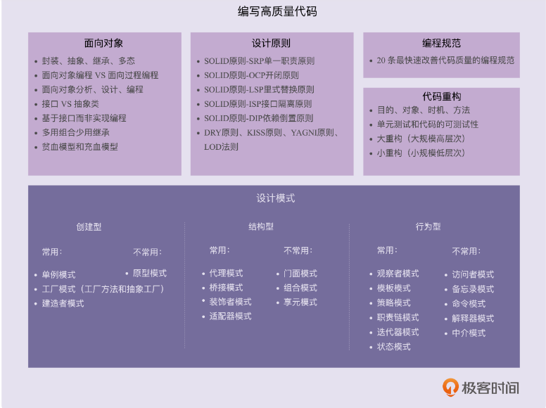

## 设计模式之美笔记

### 1、代码质量的好坏和如何写出高质量的代码具备的条件

#### 1、评判代码的质量标准：

**可维护性、可读性、可扩展性**、灵活性、简洁性、可复用性、可测试性。

#### 2、具备的条件：

面向对象的设计思想、设计原则、设计模式、编码规范、重构技巧

### 2、具备条件之间的关系

#### 1、面向对象

##### 1、四大特性： 封装、抽象、继承、多态

##### 2、面向对象编程与面向过程编程的区别和联系

##### 3、面向对象分析、面向对象设计、面向对象编程

##### 4、接口和抽象类的区别以及各自的应用场景

##### 5、基于接口而非实现编程的设计思想

##### 6、多用组合少用继承的设计思想

##### 7、面向过程的贫血模型和面向对象的充血模型

#### 2、设计原则

SOLID 原则 -SRP 单一职责原则 

SOLID 原则 -OCP 开闭原则 

SOLID 原则 -LSP 里式替换原则 

SOLID 原则 -ISP 接口隔离原则

SOLID 原则 -DIP 依赖倒置原则

DRY 原则、KISS 原则、YAGNI 原则、LOD 法则

#### 3、设计模式（创建型、结构型、行为型）

##### 1、创建型

常用的有：单例模式、工厂模式（工厂方法和抽象工厂）、建造者模式

不常用的有：原型模式

##### 2、结构型

常用的有：代理模式、桥接模式、装饰者模式、适配器模式

不常用的有：门面模式、组合模式、享元模式

##### 3、行为型

常用的有：观察者模式、模板模式、策略模式、职责链模式、迭代器模式、状态模式

不常用的有：访问者模式、备忘录模式、命令模式、解释器模式、中介模式

#### 4、编程规范和代码重构

重构的目的、对象、时机、方法

保证重构不出错的技术手段：单元测试和代码的可测试性

两种不同规模的重构：大的重构（大规模高层次）和小重构（小规模低层次）

### 5、面向对象

#### 1、面向对象分析、 面向对象设计、面向对象编程

搞清楚做什么、怎么做、每个类有哪些属性方法、以及类与类之间如何交互

### 6、四大特性解决编程问题

### 7、面向对象，实际是面向过程的

 滥用 getter、setter 方法

Constants 类、Utils 类的设计问题

基于贫血模型的开发模式

